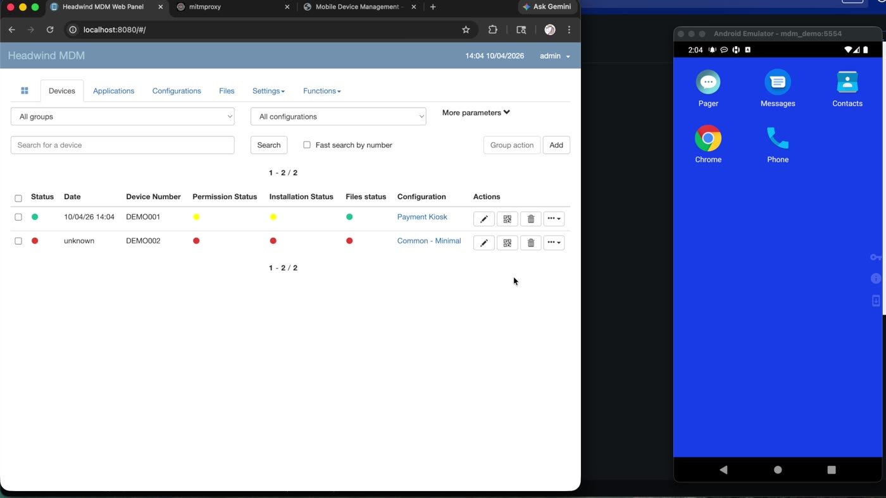
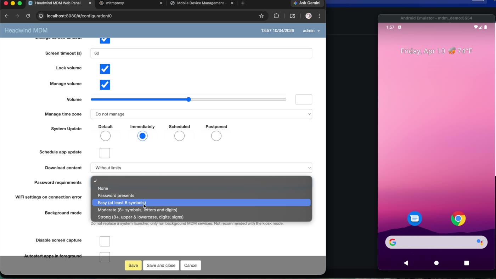
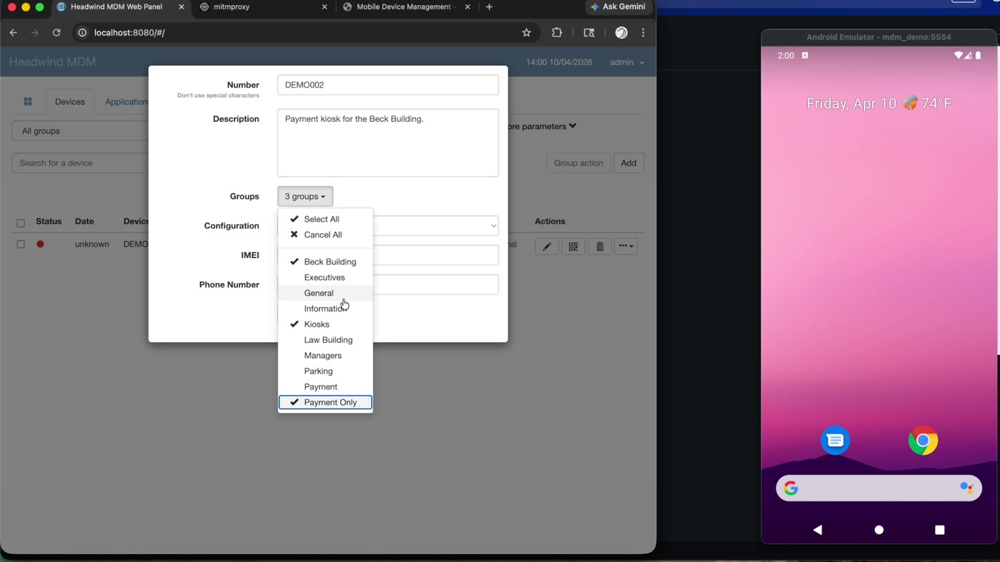
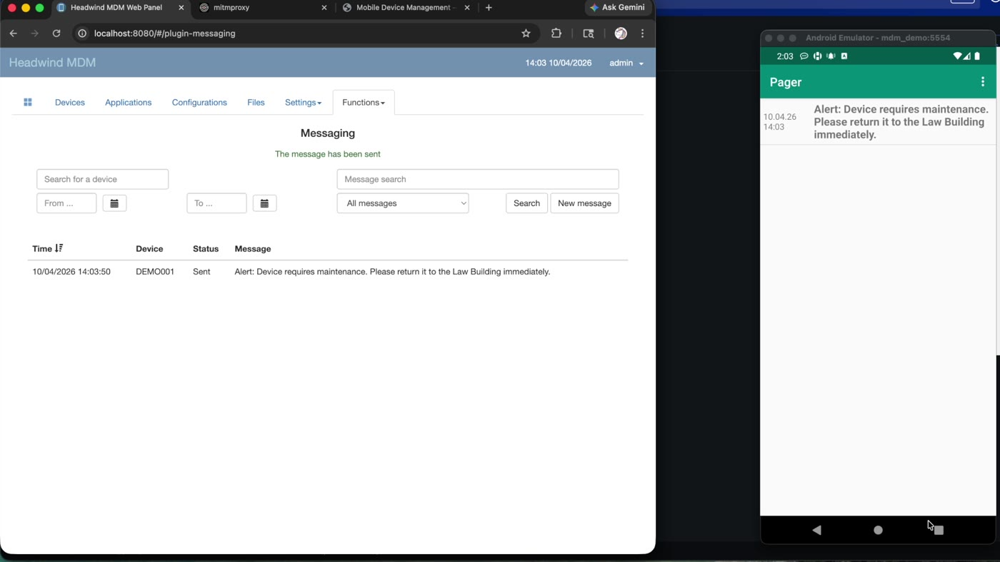
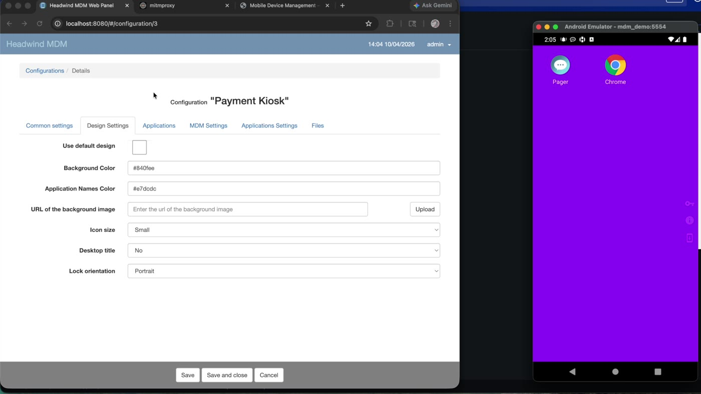
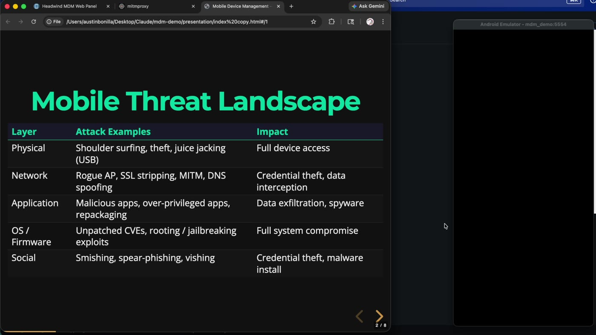
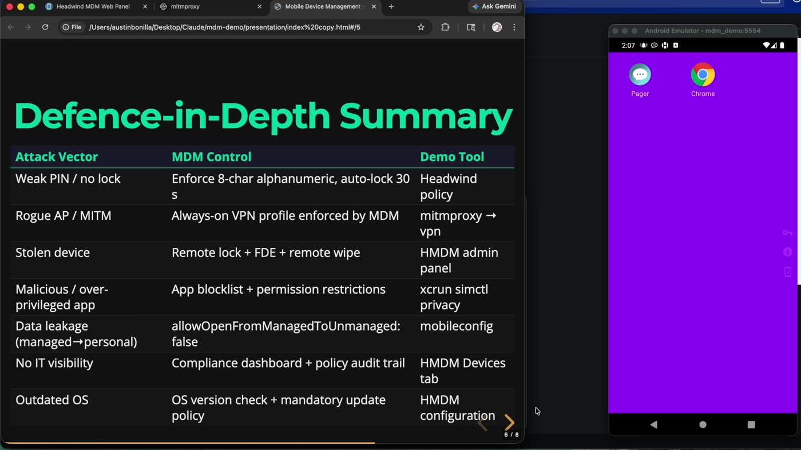

# MDM Demo — enterprise mobile device management, built and attacked on one laptop

A self-contained Mobile Device Management lab: **Headwind MDM** (Android) and **NanoMDM** (iOS)
running in Docker, an Android emulator enrolled as a managed device, and **mitmproxy** standing in
for a rogue access point. Built for ITCS-3325 *Advanced Hacking* to answer one question — what does
"policy enforcement" actually look like when a device is under an organization's control, and which
mobile attacks does it stop?

Everything runs on `localhost` against virtual devices. There is no cloud tenant, no Apple Developer
account, and no real phone involved.

> ### ⚠️ Scope and authorization
> This lab enrolls **emulated devices only** (an Android AVD and an Xcode simulator) into MDM servers
> bound to `localhost` on a single machine. The man-in-the-middle segment intercepts traffic from that
> emulator and no one else's. Credentials in this repo are throwaway values for a local demo stack —
> they unlock nothing. Enrolling, locking, wiping, or intercepting traffic from a device you do not
> own or administer is illegal without written authorization.

---

## 📺 Demo (15 min)

[](https://youtu.be/tS38zjMNz2w)

**▶ [Watch the full presentation on YouTube](https://youtu.be/tS38zjMNz2w)**

| Time | Section |
|---|---|
| 0:00 | Mobile threat landscape — physical, network, application, OS, social |
| 1:25 | What MDM is, and why it is not an acceptable-use policy |
| 2:20 | Headwind MDM admin panel — the device inventory |
| 2:50 | Building the "Payment Kiosk" configuration from scratch, setting by setting |
| 6:20 | Kiosk app list, Wi-Fi profile, and QR-code enrollment options |
| 7:20 | Creating a device slot and assigning it to groups |
| 9:20 | Enrolling the Android emulator — permissions, Device Owner, device ID |
| 10:15 | Pushing an alert message to the enrolled device |
| 11:20 | Kiosk mode enforced — the device is locked to two apps |
| 11:40 | Changing kiosk branding live and watching it land on the device |
| 12:20 | How the lab was built, and what broke along the way |
| 13:50 | Defence-in-depth summary and key takeaways |

---

## What the lab actually shows

**1. Enforcement, not guidance.** The distinction the demo is built around: an acceptable-use policy
asks a user to turn on a screen lock; MDM pushes the setting and removes the option. Every control
below is applied from the server and cannot be reverted on the device.

**2. A kiosk configuration is a long list of small decisions.** The "Payment Kiosk" profile built on
camera in ~3 minutes:

| Setting | Value | Why |
|---|---|---|
| Push channel | MQTT (port 31000) | Lighter than HTTP polling; policy changes land in seconds |
| Keep-alive | 3 min | Under the 5-minute threshold, so a missing device is noticed fast |
| Location tracking | GPS on | Fixed-location asset — movement is itself an alert |
| Bluetooth / USB storage | Disabled | Removes juice-jacking and sideloading paths |
| Wi-Fi / mobile data | Wi-Fi required, mobile as fallback | A kiosk that drops offline stops taking payments |
| Screen timeout | 60 s | Unattended terminal in a public space |
| Passcode | 6 symbols, "easy" | Shared by rotating attendants — usability constraint, documented as such |
| System updates | Immediate | No deferral window on an internet-facing payment device |
| Screenshots | Blocked | Card data on screen |
| Volume | Locked | Payment-confirmation tone must be audible |
| Background mode | Off (full MDM control) | The MDM launcher *is* the device UI |
| Permissions | Auto-granted | No user prompts on an unattended terminal |

**3. Kiosk mode is a real lockdown.** After the policy syncs, the emulator's launcher is replaced:
two apps (a pager for MDM messages, and the "payment app" stood in by Chrome), no recents button, no
kiosk-exit button, no way back to Android's settings. The home and power buttons stay enabled
deliberately — an attendant has to be able to restart the terminal.

**4. Group-based targeting scales the policy.** The device slot for `DEMO002` is filed into three
groups at once — *Beck Building*, *Kiosks*, *Payment Only* — which is how one configuration reaches a
fleet without touching devices individually.

**5. Round-trip control is measured in seconds.** An alert pushed from the admin panel
("Device requires maintenance. Please return it to the Law Building immediately.") arrives on the
device and flips from **Sent** to **Read** in the console. A background-colour change to the kiosk
profile appears on the emulator on the next sync, in under a minute.

**6. Where the demo stops, and why.** QR-code enrollment never worked against a local server — the
generated URL points at `10.0.2.2` and the emulator's browser refuses the connection, so enrollment
was completed by typing the device ID by hand. iOS remote lock and wipe need Apple's APNs push
infrastructure and a paid developer account; the iOS half of the lab installs and inspects a real
`.mobileconfig` profile and uses `xcrun simctl` as the stand-in for push. Both limits are stated in
the recording rather than edited around.

**7. The honest limit of MDM.** It is one layer. It does not survive physical access to an
unencrypted device, and it does not stop social engineering or zero-days — the summary slide maps
each attack vector to the control that answers it, and to the ones that remain open.

---

## Surfaces

### Kiosk policy enforced on a live device

`DEMO001` reports green (online, synced, policy applied) in the Headwind console while the emulator
shows the managed launcher — the entire app drawer replaced by the allow-list.

### Building the configuration

Password requirements, screen timeout, volume lock, and update policy — the settings that make up the
security baseline, chosen for a shared payment terminal rather than copied from a template.

### Device slot and group assignment

A device is created before it enrolls, and tagged by building, device class, and function. Groups are
how a policy reaches a fleet.

### Push messaging round trip

An operational alert sent from the console, received by the pager app on the locked device, and
acknowledged back to the server as **Read**.

### Live policy change

Editing the kiosk's design settings and watching the device repaint on its next MQTT sync — the same
mechanism that would push a passcode change or an app blocklist.

### The threat model it answers


Each attack vector mapped to the MDM control that answers it and the tool in this stack that
demonstrates it.

---

## Architecture

| Service | Role | Endpoint | Credentials |
|---|---|---|---|
| Headwind MDM | Android MDM server + admin console | http://localhost:8080 | `admin` / `admin123` |
| NanoMDM | iOS MDM server (check-in + API) | http://localhost:9000 | — |
| PostgreSQL | Shared store (`hmdm` + `nanomdm` DBs) | container-internal | `hmdm` / `hmdm_pass` |
| mitmproxy (web UI) | Rogue-AP interception console | http://localhost:8082 | password: `admin` |
| mitmproxy (listener) | Proxy the emulator is pointed at | localhost:8081 | — |
| HMDM MQTT | Real-time policy push channel | localhost:31000 | — |
| Android emulator | Managed device (`mdm_demo`, API 30, arm64) | reaches host at `10.0.2.2` | — |
| iOS simulator | Managed device (`MDM-Demo-iPhone`, iOS 17.4) | — | — |

All credentials above are local-only demo values; nothing here is reachable from outside the machine.

```
                    ┌──────────────────────────────┐
                    │        macOS host            │
                    │                              │
  admin console ───►│  Headwind MDM  :8080  ──┐    │
                    │  NanoMDM       :9000  ──┼─► PostgreSQL
                    │  mitmproxy     :8081/2  │    │
                    │            ▲            │    │
                    └────────────┼────────────┼────┘
                                 │            │
                   proxied HTTP  │            │ MQTT :31000 (policy push)
                                 │            ▼
                    ┌────────────┴───────────────────────┐
                    │  Android emulator (10.0.2.2 → host)│
                    │  1. install agent APK              │
                    │  2. grant Device Owner (dpm)       │
                    │  3. enter server URL + device ID   │
                    │  4. sync → kiosk policy applied    │
                    │  5. push message / lock / wipe     │
                    └────────────────────────────────────┘
```

---

## Running it

Requires Docker Desktop, Android Studio (for the AVD), and Xcode command-line tools on macOS.

```bash
./setup.sh                 # certs, Docker stack, AVD, iOS simulator, profiles
./verify.sh                # pre-flight check — run this before presenting
```

Use `docker-compose` (hyphenated) — the stack is built against the standalone binary.

```bash
docker-compose up -d       # start everything
docker-compose down        # stop, keep data
docker-compose down -v     # stop and wipe all data
```

Enroll the Android device — the Device Owner grant **must** happen before the agent's first launch,
or kiosk and password policies silently fail:

```bash
docker cp hmdm-server:/usr/local/tomcat/work/files/hmdm-6.14-os.apk android/hmdm-agent.apk
adb install -r android/hmdm-agent.apk
adb shell dpm set-device-owner com.hmdm.launcher/com.hmdm.launcher.AdminReceiver
adb shell monkey -p com.hmdm.launcher -c android.intent.category.LAUNCHER 1
# in the agent: server URL http://10.0.2.2:8080 , device ID DEMO001
```

Demo drivers:

```bash
./android/adb-demo.sh info      # encryption state, device admin, proxy status
./android/adb-demo.sh mitm      # route the emulator through mitmproxy (rogue AP)
./android/adb-demo.sh vpn       # clear the proxy (MDM-enforced VPN defence)
./android/adb-demo.sh lock      # remote lock
./ios/ios-sim-demo.sh show-profile   # pretty-print the .mobileconfig
./ios/ios-sim-demo.sh install        # install the iOS configuration profile
./ios/ios-sim-demo.sh grant-revoke   # per-app camera permission control
./reset-demo.sh                 # back to a clean starting point
```

### Gotchas worth knowing before you rebuild this

- **`localhost` is a lie inside the emulator.** It resolves to the emulator itself; the host is
  `10.0.2.2`. Every server URL stored in the HMDM database has to be rewritten after a reset.
- **Device Owner before first launch**, or the kiosk and passcode policies apply as no-ops.
- **MQTT port 31000 must be published** in `docker-compose.yml` or policy pushes never reach the
  device in real time — they only land on the next poll.
- **A kiosk configuration needs `mainappid`, `contentappid`, and `eventreceivingcomponent` all set**,
  or the sync response throws a `NullPointerException` on the device.
- **HMDM won't save a configuration if any listed app has an empty `url`.** System apps need a
  placeholder URL just to appear in the UI.
- **NanoMDM must use the `pgsql` storage driver** — file storage is deprecated in v0.9.0 and crashes
  when a CA cert is present.
- **The `./certs` bind mount deadlocks Docker Desktop on macOS.** The CA cert is embedded inline in
  `docker-compose.yml` as a Docker `config` object instead. Don't switch it back.
- **`adb emu kill` doesn't stop this emulator.** Use
  `pkill -9 -f "qemu-system|emulator64|emulator-arm|emulator.*mdm_demo"`.
- **Erase the iOS simulator only while it is shut down** — `stop` then `reset`, never `reset` alone.
- **NanoMDM returning 404 at `/` is correct.** It answers on `/mdm` (HTTP 400 there means healthy)
  and `/v1/`.
- `verify.sh` checks for a `scep-server` container that isn't defined — that failure is expected and
  only matters for real iOS PKI enrollment.

Full working notes, including the HMDM password-hash algorithm and database repair commands, are in
[`docs/OPERATOR-NOTES.md`](docs/OPERATOR-NOTES.md).

---

## Layout

```
.
├── docker-compose.yml       # Headwind MDM, NanoMDM, Postgres, mitmproxy; CA cert inlined as a config
├── setup.sh                 # one-shot build: TLS material, containers, AVD, simulator, profiles
├── verify.sh                # pre-flight health check across every service and device
├── reset-demo.sh            # wipe enrolled devices and state, restore demo starting point
├── android/
│   ├── adb-demo.sh          # live demo commands: enroll, info, mitm, vpn, lock, audit, wipe
│   └── avd-setup.sh         # AVD lifecycle — create, start, stop, status
├── ios/
│   ├── ios-sim-demo.sh      # simulator control, profile install, permission grant/revoke, wipe
│   └── profiles/
│       └── security-policy.mobileconfig   # passcode, restrictions, managed-app data controls
├── certs/                   # server.ext template; keys and certs are generated by setup.sh
├── presentation/
│   ├── index.html           # full 15-slide Reveal.js deck with speaker notes (press S)
│   ├── index-presented.html # trimmed 8-slide deck used in the recording
│   └── austin-bonilla-mdm-demo-transcript.docx
└── docs/
    ├── OPERATOR-NOTES.md    # credentials, platform quirks, database repair commands
    └── screenshots/         # stills pulled from the recording
```

The recording itself is not in git — it lives on [YouTube](https://youtu.be/tS38zjMNz2w). The
Headwind agent APK is pulled from the running container rather than committed.

## Built with

Headwind MDM 6.14 · NanoMDM 0.9 · mitmproxy · PostgreSQL · Docker Compose · Android Emulator (API 30,
arm64) · Xcode iOS Simulator 17.4 · Reveal.js · bash

## License / use

Coursework, published as a portfolio piece. Reuse the scripts and configuration freely for teaching
or lab work. Point them only at devices you own or are authorized in writing to administer.

*Austin Bonilla — ITCS-3325-003 Advanced Hacking, BAT in Cybersecurity, St. Philip's College*
